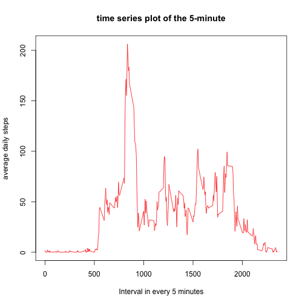

# Reproducible Research: Peer Assessment 1


## Loading and preprocessing the data

```r
library(lattice)
data <- read.csv("activity.csv", stringsAsFactors = F)
data$date <- as.Date(data$date)
```


## What is mean total number of steps taken per day?
### A histogram of the total number of steps taken each day

```r
sum_data <- aggregate(data$steps ~ data$date, sum, data = data)
hist(sum_data[, 2], breaks = 30, main = "A histogram of the total number of steps taken each day", 
    xlab = "the total number of steps taken each day", col = "black")
```

 

### What is mean total number of steps taken per day?

```r
mean(sum_data[, 2])
```

```
## [1] 10766
```

### What is median total number of steps taken per day?

```r
median(sum_data[, 2])
```

```
## [1] 10765
```


## What is the average daily activity pattern?
### a time series plot of the 5-minute

```r
mean_data <- aggregate(data$steps ~ data$interval, mean, data = data)
plot(mean_data[, 1], mean_data[, 2], type = "l", xlab = "Interval in every 5 minutes", 
    ylab = "average daily steps", col = "red", main = "time series plot of the 5-minute")
```

 


### Which 5-minute interval, on average across all the days in the dataset, contains the maximum number of steps?

```r
mean_data[mean_data[, 2] == max(mean_data[, 2]), 1]
```

```
## [1] 835
```


## Imputing missing values
### Calculate and report the total number of missing values in the dataset

```r
na_data <- data[is.na(data), ]
nrow(na_data)
```

```
## [1] 2304
```

### Fill missing value for that 5-minute interval with mean value, and create a new dataset

```r
new_data <- data
for (row in seq(nrow(new_data))) {
    if (is.na(new_data[row, 1])) {
        new_data[row, 1] <- mean_data[mean_data[, 1] == new_data[row, 3], 2]
    }
}
```

### A histogram of the total number of steps taken each day for new dataset

```r
new_sum_data <- aggregate(new_data$steps ~ new_data$date, sum, data = new_data)
hist(new_sum_data[, 2], breaks = 30, main = "A histogram of the total number of steps taken each day for new dataset", 
    xlab = "the total number of steps taken each day", col = "black")
```

 

### What is new dataset's mean total number of steps taken per day?

```r
mean(new_sum_data[, 2])
```

```
## [1] 10766
```

### What is new dataset's median total number of steps taken per day?

```r
median(new_sum_data[, 2])
```

```
## [1] 10766
```

the values differ from the estimates from the first part of the assignment, because we filled missing value with the average steps for that 5 minutes interval, this change made the data a little different.
## Are there differences in activity patterns between weekdays and weekends?

```r
weekday <- weekdays(new_data[, 2])
weekday[weekday != "Saturday" & weekday != "Sunday"] <- "weekday"
weekday[weekday == "Saturday" | weekday == "Sunday"] <- "weekend"
weekday <- factor(weekday)
new_data <- cbind(new_data, weekday)
mean_data <- aggregate(steps ~ interval + weekday, mean, data = new_data)
xyplot(steps ~ interval | weekday, mean_data, type = "l", layout = c(1, 2), 
    xlab = "Interval", ylab = "Number of steps")
```

 

